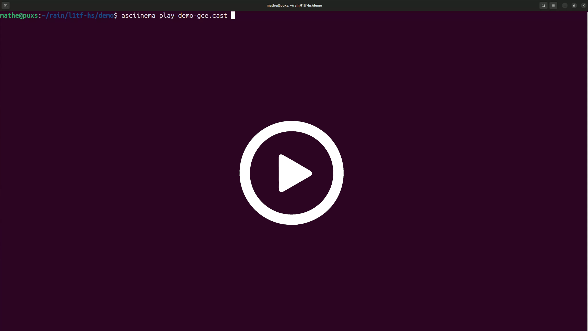

# Rain

The Rain research project shows how a malicious virtual machine can abuse
transient execution vulnerabilities to leak data from the host, as well as from
other virtual machines. This repository contains the research artifact: the
L1TF Reloaded exploit and instructions on how to reproduce our results.

For details, we refer you to:

- our S&P'26 paper: ["Rain: Transiently Leaking Data from Public Clouds Using Old Vulnerabilities"](https://download.vusec.net/papers/rain_sp26.pdf)
- our project page: ["Rain: Cloud Leakage via Hardware Vulnerabilities"](https://www.vusec.net/projects/rain/)
- our blog post together with Google: ["Project Rain:L1TF"](https://bughunters.google.com/blog/4684191115575296/project-Rain-L1tf)
- AWS's blog post: ["Amazon EC2 defenses against L1TF Reloaded"](https://aws.amazon.com/blogs/security/ec2-defenses-against-l1tf-reloaded/)
- WHY2025 public disclosure: ["Spectre in the real world: Leaking your private data from the cloud with CPU vulnerabilities"](https://program.why2025.org/why2025/talk/DG7VSX/)
- Hardware.io NL 2025 talk: ["Real-World Exploitation of Transient Execution Vulnerabilities to Leak Private Data from Public Clouds"](https://www.hardwear.io/netherlands-2025/speakers/mathe-hertogh.php)

# The Exploit: "L1TF Reloaded"

Our end-to-end exploit, called "L1TF Reloaded", abuses two long-known transient
execution vulnerabilities: [L1TF](https://foreshadowattack.eu/foreshadow-NG.pdf)
and [(Half-)Spectre](https://spectreattack.com/spectre.pdf). By combining them,
commonly deployed software-based mitigations against L1TF, such as
[L1d flushing](https://www.kernel.org/doc/html/latest/admin-guide/hw-vuln/l1d_flush.html)
and [core scheduling](https://www.man7.org/linux/man-pages/man1/coresched.1.html),
can be circumvented.

We have launched our exploit against the production clouds of both AWS and
Google. Below is a (fast-forwarded) recording of our exploit running within a VM
on GCE. The exploit, at runtime, finds another VM on the same physical host,
detects that it is running an Nginx webserver, and leaks its private TLS key.

 

# Repository Contents

This repository is structured as follows:

- `deps`: exploit dependencies
- `include`: exploit headers files
- `scripts`: utility scripts
- `setup`: reproduction resources
- `src`: exploit source code

# Reproduction Instructions

We provide detailed reproduction instructions for:

- [Exploiting Google Cloud Engine](setup/setup-gce.md)
- [Exploiting a local Skylake server](setup/setup-local.md)

# Mitigation

The specific gadgets that we leverage [have been patched in KVM](https://lore.kernel.org/kvm/20250804064405.4802-1-thijs@raymakers.nl/T/).
On Intel CPUs that are affected by L1TF, only stable kernel releases before
5.4.298, 5.10.242, 5.15.191, 6.1.150, 6.6.104, 6.12.45 or 6.16.5 are vulnerable
to this specific attack. The underlying issue is still there, but a different
half-Spectre gadget is necessary to exploit L1TF Reloaded on up-to-date
production systems. As discussed in our paper, we recommend deploying additional
blanket mitigations against L1TF Reloaded's attack strategy, as well as other
microarchitectural attacks in general.
