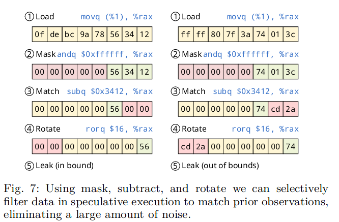
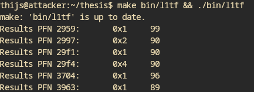

- Debugging the RIDL PoC will probably take a while
	- Might need to look at performance counters and such to see if anything happens in the line fill buffer
- Change of plan: Maybe start with replicating the L1TF vunerability, specifically the L1TF one.
	- If I understand it correctly, even with mitigations like as PTE inversion and conditional cache flushes this should with on SMT sibling cores
- The Foreshadow-VMM paper describes the process of setting this up quite clearly, shouldn't be too hard I guess \*knocks on wood*
- IT WORKS! 🎉
	- Running a victim program on all cores that writes "SECRET" + CPU core number
	- By using the mask, subtract and rotate method from the RIDL paper to filter out everything else
		- 
	- 
	- Able to leak data from the L1d cache by modifying the PFN
	- It is a bit hacky but at least I can confirm that is can leak the data from sibling CPU cores even with the default L1tf mitigations being on (PTE Inversion; VMX conditional cache flushes, SMT vulnerable)
		- "works on my machine" at least, haven't tested in on hwsec machine
	-