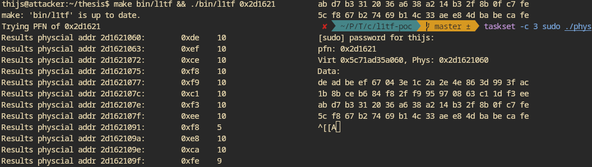

- I just realized that I was setting `PTEDIT_PAGE_PRESENT` (defined as 1) instead of `PTEDIT_PAGE_BIT_PRESENT` (defined as 0). In reality, this meant that I was setting `PTEDIT_PAGE_BIT_RW` (defined as 1) in the page table entries which of course doesn't generate a fault
- From intel manual
	- > there can be a TLB entry for a page number only if the P flag is 1 and the reserved bits are 0 in each of the paging-structure entries used to translate that page number. In addition, the processor does not cache a translation for a page number unless the accessed flag is 1 in each of the paging-structure entries used during translation; before caching a translation, the processor sets any of these accessed flags that is not already 1.
	- No point of bringing the leaked thing to the TLB
- Actually got L1tf to work 🎉
	- > When the Probe will access again the tmp variable, the kernel will perform a page walk, arriving on the tampered PTE. It will find that the PTE is not valid, since the present bit has been cleared, rising an exception which will abruptly terminates the Probe after a certain time window
	- I tried to do the access speculatively, which didn't cause the kernel to raise the exception
	- Using a custom segfault handler for error suppression did work though
- However, I am not able to read some of the bytes, no matter how often I read. They are just not in the cache.
	- 