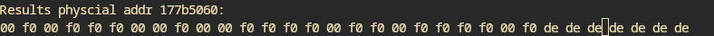

- Experiment with searching fast for a small known starting value of a page
- I tried leaking a known PFN from a guest VM from the attacker VM but I just get zeroes back
	- attacker VM to host PFN does work
	- Strange, because PFN should be identical in L1d cache
- Well, I get some zeroes back, but also some weird data halfway the cacheline
	- 
	- even if the PFN is sort of garbage, I still get data there
		- Mathé said that it might look like MDS but he is not entirely sure
			- Has all the properties of MDS
			- Unfortunately, there is no CPU that is vulnerable to MDS but not L1tf
	-
- Smart way of scanning through memory of a known value
	- FLUSH+RELOAD a single cell of the reload buffer and only check that single cell
	- Should speed up the checking of pages by a lot
	- Fallback to the "slow" variant if there is a match