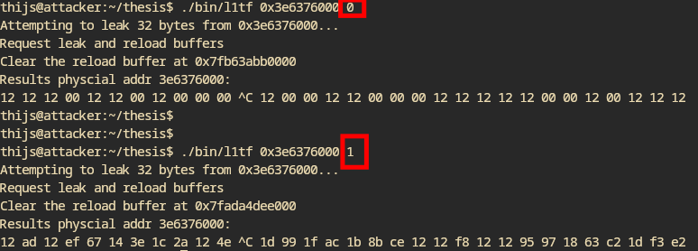

- Restructured the l1tf code so certain parts are confined to their own function and easier to reason about
- Plan: have a page with a known value and quickly scan memory for the starting character
	- I tried this, but it is still quite slow because it has to wait on the segfaults all the time so there is not much of a speedup
	- "As noted in Section 4.3, Section 4.4.2, and Section 4.5, there is no translation for a linear address if the translation process for that address would use a paging-structure entry in which the P flag (bit 0) is 0 or one that sets a reserved bit" - Intel Manual Volume 3
- To verify whether L1tf can be done speculatively at all, do the branch misprediction thing that Mathé mentioned and use that to confirm (or disprove) that it cannot be done speculatively
	- If it cannot be done speculatively, then we have to do some kernel hacking
	- 
	- Well... Seems like L1tf really relies on an architectural faults and speculative faults don't work (in picture above, 0 is dont do it and 1 is do it)
	- ```c
	    if (*do_l1tf) {
	      dummy = *reload_buffer[1][0x1];
	      asm_l1tf_leak_nibbles(leak_addr, reload_buffer);
	      dummy = *reload_buffer[0][0x2];
	    }
	  ```
- Plan for victim: run nginx server on victim and leak from there with L1tf
	- Architecture of nginx is as follows
	- {:height 447, :width 740}
	- From https://www.nginx.com/blog/inside-nginx-how-we-designed-for-performance-scale/