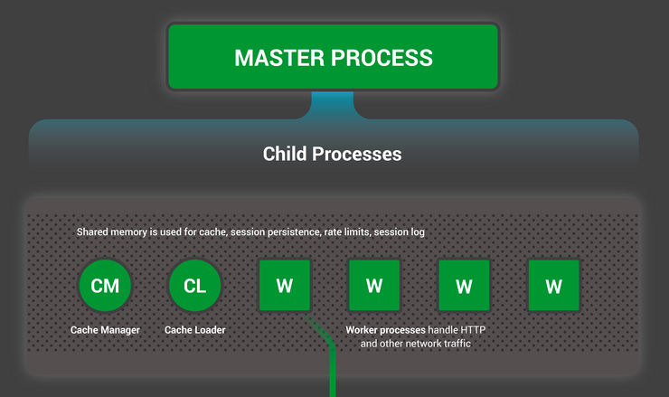

- Restructured the l1tf code so certain parts are confined to their own function and easier to reason about
- Plan: have a page with a known value and quickly scan memory for the starting character
- Plan: run nginx server on victim and leak from there with L1tf
	- Architecture of nginx is as follows
	- {:height 447, :width 740}
	- From https://www.nginx.com/blog/inside-nginx-how-we-designed-for-performance-scale/
-