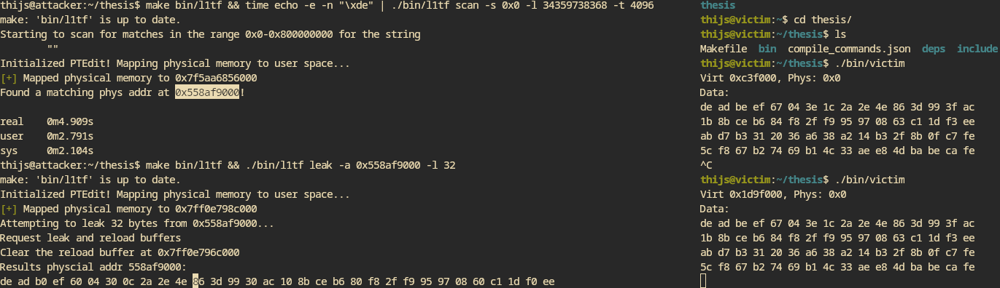

- Letting the code work:
	- compile and link it statically
	- quit the program with by calling the exit call instead of returning
		- this was the culprit earlier because it was returning to RIP=0x1, which would trigger a page fault which would go either back to my handler or crash due to a segmentation fault.
		- but of course, without the libc runtime you need to call the exit syscall manually
- Performance is actually good
	- Tested in a minimal kernel using busybox init and a program that is just triggering segfaults all the time
	- 100000000 bytes / 25.78s
	- (100000000 bytes) / (25.78 seconds) ≈ 4.325166285 s / (16777216 B)
		- a bit more than 4 seconds to scan a single byte of all pages of a 64GiB system
		- actually feasible now
- Compiling for with the debian config on the hwsec machine now
- A context switch to handle the segfault is no longer expensive because no state is saved
	- Can we make the PTEditor calls faster as well?
		- The `void ptedit_use_implementation(int implementation)` call allows the following option
		  > `PTEDIT_IMPL_USER` maps the physical memory to user space and only requires switches to the kernel for flushing the TLB after page-table updates.
		- Do we even need the flush the TLB?
		  > Because the TLBs cache entries only for linear addresses with translations, there can be a TLB entry for a page
		  number only if the P flag is 1 and the reserved bits are 0 in each of the paging-structure entries used to translate
		  that page number - *Intel manual 4.10.2.3 "Details of TLB Use"*
		- Because we only deal with non present pages with L1tf, we can skip the TLB invalidation because the virtual address is not in the TLB anyway
		- This would skip another context switch
		- We need to modify the PTEditor to do this
			- The modification has been to introduce an additional field to the `ptedit_entry_t` struct that is a pointer to the PTE in user mapped memory
		-
- Modification worked! Now I can actually change the PTE without any additional syscalls/context switches besides the initial ones -> **SPEED**
- I have decided to make the l1tf program a bit more flexible so it can both scan and leak, depending on the arguments
- 
- Cross VM leaks -> *IT WORKS!*