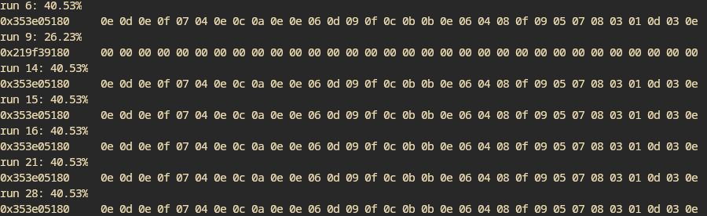
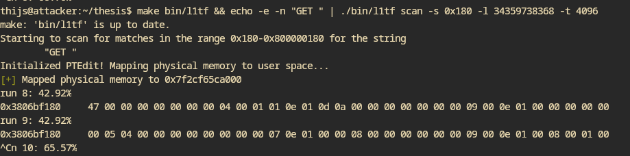

- I modified nginx so it prints the location of the HTTP method like "GET" or "POST"
	- It reports the following addresses
		- `0x55853940D180`
		- `0x55D0319D1180`
		- `0x559E0D694180`
		- `0x55a7769b6180`
	- They consistently have the same offset within a page!
	- Let's try to scan for it
	- Cannot seem to find anything
- Searching for `0xbeef6704` at offset 2 in the victim program also gives no results. Maybe something is broken with non-zero offsets?
	- Yes, I was always assuming a zero-offset
- + the results are much worse for leaking, I only get zeroes back while yesterday I got much more back
	- This was me adding `-O1` to the cflags. Removing it / setting it to `-O0` gave back the usable results
- I'm not able to leak anything from the nginx memory. Is it too slow?
- Adding a sleep to the victim program also completely destroys the ability to leak anything
	- Triggering the read about 1000 times a second gives some results, but less frequent it becomes more difficult
		- 
		  Also getting only the second part of the nibbles
- Leaking nginx but by spamming a lot of requests to it
	- 
	- Actually works! (IF you send a lot of requests)
	- The partial nibbles is a bit annoying though
		- Maybe I can do some alternating thing where it would first get one, and then the other?
	-