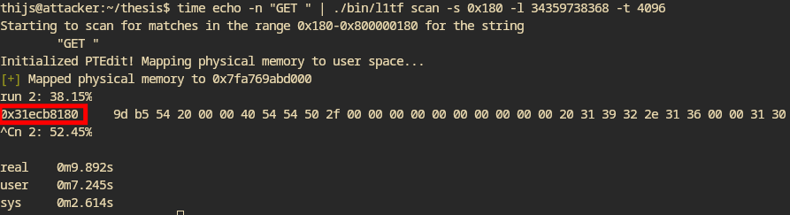
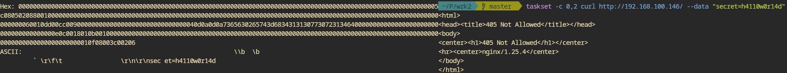

- Leaking the data in nibble for nibble seems to work great
- Printing the ASCII of the data instead of just the hex shows a somewhat visible data pattern
- Made something that detects weird MDS bytes at specific page offsets
- nginx
	- 
	  After an initial training phase where we bombard the server with request for a few seconds, we can find the physical address
	- Knowing the physical address, we can leak memory!
	  
	  Left: attacker VM, right: a client of the nginx server running (explicitly running on different cores to rule out that the data came from the client and not the server)
	  As you can see, *it is possible to leak the data that the client is sending*!